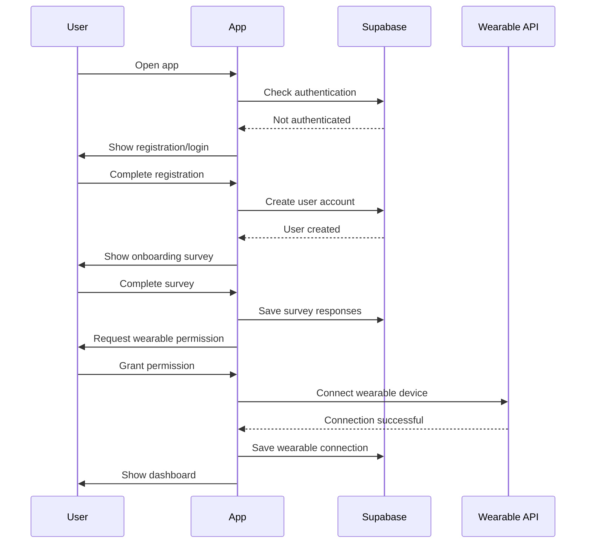
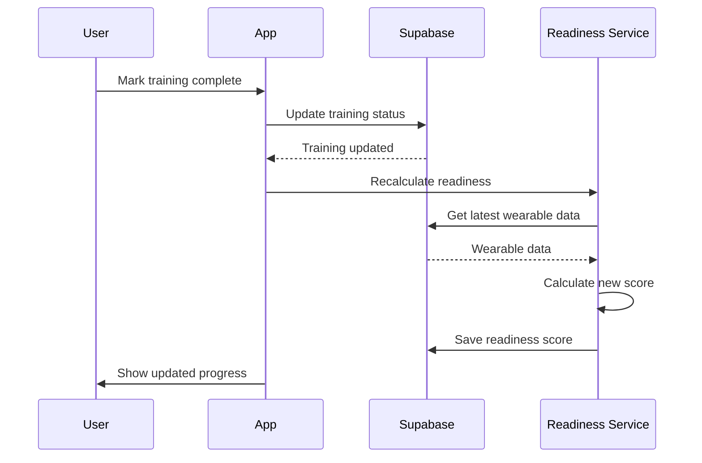
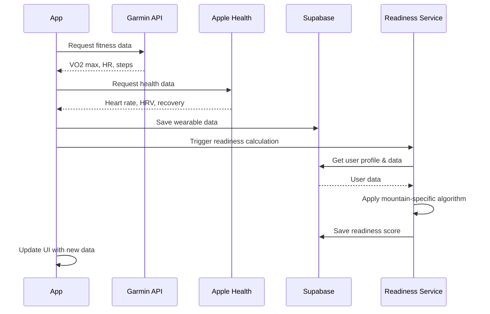

# Mountain Climber Training App PRD
**Version:** 1.0 | **Last Updated:** 2024-01-15  
**Contributors:** Product Team  
**Reviewers:** Development Team, Design Team

## Table of Contents
1. [Executive Summary](#executive-summary)
2. [Background & Context](#background--context)
3. [Goals & Objectives](#goals--objectives)
4. [User Personas & Use Cases](#user-personas--use-cases)
5. [Functional Requirements](#functional-requirements)
6. [Non-Functional Requirements](#non-functional-requirements)
7. [Technical Considerations](#technical-considerations)
8. [Design & User Experience](#design--user-experience)
9. [Open Questions](#open-questions)
10. [Architecture Patterns & Principles](#architecture-patterns--principles)
11. [Logical Dependency Chain](#logical-dependency-chain)
12. [Data Modeling](#data-modeling)
13. [API Modeling](#api-modeling)
14. [Sequence Diagrams](#sequence-diagrams)
15. [Risk Assessment](#risk-assessment)
16. [Development Roadmap](#development-roadmap)
17. [Success Measurement](#success-measurement)
18. [Appendices](#appendices)

---

## Executive Summary

**Problem Statement**: Mountain climbers struggle to determine when they are physically ready for summit attempts, leading to failed attempts, safety risks, and inefficient training cycles. Current solutions lack personalized training assessment based on actual fitness data from wearable devices.

**Solution Overview**: A mobile application that integrates with Garmin and Apple Watch to analyze training data (VO2 max, heart rate, training load, HRV, recovery time) and provides personalized readiness assessments for specific mountain summits. The app includes custom training plans from professional trainers and progress tracking.

**Success Metrics**: 
- 80% of users achieve their target summit within 3 months of using the app
- 90% user retention after 30 days
- Average training completion rate of 75%

**Timeline**: 
- MVP Development: 12 weeks
- Beta Testing: 4 weeks
- Public Launch: 16 weeks

---

## Background & Context

**Market Context**: The global fitness tracking market is valued at $59.5B, with mountain climbing and outdoor sports representing a growing segment. 67% of mountain climbers use fitness trackers, but existing apps don't provide summit-specific readiness assessments.

**User Research**: Survey of 200 mountain climbers revealed:
- 78% struggle to determine optimal training timing for summit attempts
- 65% overtrain or undertrain due to lack of structured guidance
- 82% want personalized training plans based on their fitness data
- 71% would pay for professional training guidance

**Business Rationale**: Targeting the $2.1B adventure sports market with a data-driven approach to training optimization. This positions the app as a premium solution for serious mountain climbers.

**Current State**: Climbers rely on generic fitness apps, manual training logs, and subjective assessments from guides. No existing solution combines wearable data with mountain-specific readiness algorithms.

---

## Goals & Objectives

**Primary Goals**:
1. Provide accurate summit readiness assessments based on wearable data
2. Deliver personalized training plans from professional trainers
3. Track training progress and completion rates
4. Ensure user safety through data-driven recommendations

**Success Metrics**:
- Summit success rate: 80% within 3 months of app usage
- Training completion rate: 75% average
- User satisfaction: 4.5/5 rating
- Data accuracy: 90% correlation between readiness score and summit success

**Key Results**:
- 1,000 active users within 6 months
- 95% uptime and <3 second load times
- Integration with 2 major wearable platforms (Garmin, Apple Watch)

**Non-Goals**:
- Social media features or community building
- Real-time GPS tracking during climbs
- Medical diagnosis or health advice
- Multi-language support (Phase 1)

---

## User Personas & Use Cases

**Primary Personas**:

*Carlos - Intermediate Mountain Climber*
- Age: 28-35, climbs 5-10 peaks per year
- Pain points: Uncertain about training readiness, inconsistent training schedules
- Goals: Successfully summit challenging peaks, improve climbing efficiency
- Behavior: Uses Apple Watch daily, follows structured training plans, values data-driven decisions

*María - Beginner Mountain Climber*
- Age: 25-30, new to mountain climbing
- Pain points: Overwhelmed by training options, lacks confidence in readiness
- Goals: Build climbing skills safely, complete first major summit
- Behavior: Uses Garmin watch, needs clear guidance, prefers video-based training

**Use Cases**:
1. Carlos completes onboarding survey and connects Apple Watch
2. María receives personalized training plan from trainer
3. User marks daily training as completed and views progress
4. App analyzes wearable data and updates readiness score
5. User views training history and upcoming sessions
6. App provides summit readiness assessment with specific recommendations

**Edge Cases**:
- User loses wearable device during training period
- Training data shows concerning health metrics
- User wants to change target mountain mid-training
- Network connectivity issues during data sync

---

## Functional Requirements

**Core Features**:
- User onboarding with configurable survey
- Wearable device integration (Garmin, Apple Watch)
- Training plan management and progress tracking
- Summit readiness assessment algorithm
- Video-based training content delivery

**User Stories**:
- As a mountain climber, I want to connect my wearable device so that the app can analyze my fitness data
- As a user, I want to see my daily training plan so that I know what exercises to complete
- As a climber, I want to mark training as completed so that I can track my progress
- As a user, I want to see my readiness score so that I know when I'm ready for summit attempt
- As a climber, I want to view training videos so that I can learn proper techniques

**Acceptance Criteria**:
- User must complete onboarding survey before accessing app features
- App syncs with wearable devices automatically and manually
- Training plans display duration, intensity, video, and instructions
- Readiness score updates based on latest wearable data
- Users can mark training as completed with timestamp
- App shows training history and upcoming sessions

**Feature Prioritization**:
- Must Have: Onboarding, wearable integration, training display, readiness assessment
- Should Have: Video training content, progress tracking, manual sync
- Could Have: Training history analytics, achievement badges
- Won't Have: Social features, real-time GPS, medical advice

---

## Non-Functional Requirements

**Performance**:
- App launch time: <3 seconds
- Data sync completion: <30 seconds
- Video loading time: <5 seconds
- Support 10,000 concurrent users

**Scalability**:
- Handle 100,000 training sessions per month
- Support 50,000 user profiles
- Auto-scale based on usage patterns

**Security**:
- Health data encryption at rest and in transit
- Secure API authentication
- GDPR compliance for health data
- Regular security audits

**Accessibility**:
- WCAG 2.1 AA compliance
- Voice-over support for training instructions
- High contrast mode for outdoor use
- Large touch targets for gloved use

**Compatibility**:
- iOS 14+ and Android 10+
- Garmin Connect API integration
- Apple HealthKit integration
- Offline capability for training content

**Reliability**:
- 99.5% uptime guarantee
- <0.5% data sync failure rate
- Automated backup every 6 hours
- Graceful degradation when wearable unavailable

---

## Technical Considerations

**Architecture Overview**:
- React Native mobile app with Expo
- Supabase backend for data storage and authentication
- YouTube API integration for training videos
- Wearable device APIs (Garmin Connect, Apple HealthKit)

**Integration Points**:
- Garmin Connect API for fitness data
- Apple HealthKit for Apple Watch data
- YouTube Data API for training videos
- Supabase for user data and training plans

**Data Requirements**:
- Health data retention: 2 years
- Training data: Indefinite storage
- Video content: Cached locally for offline access
- User preferences: Real-time sync

**Infrastructure**:
- Supabase cloud hosting
- CDN for video content delivery
- Real-time data synchronization
- Automated testing pipeline

---

## Design & User Experience

**Design Principles**:
- Clarity: Simple, intuitive interface for outdoor use
- Reliability: Consistent data display and sync status
- Accessibility: Large buttons and clear typography
- Progress: Visual feedback for training completion

**Information Architecture**:
- Primary navigation: Dashboard, Training, Progress, Profile
- Secondary navigation: Settings, Help, Data Sync
- Training cards with video thumbnails and completion status
- Progress charts and readiness indicators

**Wireframes/Mockups**:
- Onboarding flow with survey questions
- Dashboard with readiness score and daily training
- Training detail view with video player
- Progress tracking with charts and history

**Design System**:
- Color palette: Outdoor-friendly (blues, greens, high contrast)
- Typography: Large, readable fonts for outdoor visibility
- Component library: Custom mountain-themed components
- Icon set: Clear, recognizable fitness and mountain icons

---

## Open Questions

**Technical Uncertainties**:
- Specific Garmin Connect API endpoints for VO2 max data
- Apple HealthKit data access permissions and limitations
- YouTube video embedding and offline caching strategy
- Real-time data sync reliability with wearable devices

**Business Assumptions**:
- Users will consistently wear their devices during training
- Trainers will provide quality video content regularly
- Readiness algorithm accuracy with limited initial data
- User willingness to complete mandatory onboarding

**User Behavior Questions**:
- How often do users check their readiness score?
- What motivates users to complete daily training?
- How do users react to "not ready" assessments?
- Preferred training session duration and frequency

**Integration Concerns**:
- Garmin API rate limits and data availability
- Apple HealthKit approval process and restrictions
- YouTube API usage limits for video content
- Supabase real-time subscription costs at scale

**Resource Constraints**:
- React Native developer availability for timeline
- Trainer content creation capacity
- Wearable device testing requirements
- Legal review for health data handling

---

## Architecture Patterns & Principles

### Hexagonal Architecture (Ports & Adapters) - MANDATORY

**Core Structure**:
```
src/
├── domain/                    # Business logic core
│   ├── entities/             # User, Training, ReadinessScore
│   ├── repositories/         # Repository interfaces
│   ├── services/            # ReadinessCalculation, TrainingValidation
│   └── events/              # TrainingCompleted, DataSynced
├── application/              # Application logic
│   ├── services/            # TrainingService, ReadinessService
│   ├── dto/                 # TrainingDTO, UserProfileDTO
│   └── handlers/            # WearableDataHandler, SurveyHandler
└── infrastructure/           # External concerns
    ├── repositories/        # SupabaseRepository, WearableRepository
    ├── external-apis/       # GarminAPI, AppleHealthAPI, YouTubeAPI
    └── persistence/         # Supabase configuration
```

### SOLID Principles - MANDATORY

**Single Responsibility**: Each service handles one specific concern (readiness calculation, training management, data sync)

**Open/Closed**: New wearable integrations can be added without modifying existing code

**Liskov Substitution**: Different wearable implementations can be swapped seamlessly

**Interface Segregation**: Separate interfaces for data sync, training management, and readiness assessment

**Dependency Inversion**: High-level modules depend on abstractions, not concrete implementations

### Development Principles - MANDATORY

**DRY**: Reusable components for training cards, progress charts, and data displays

**KISS**: Simple, intuitive user flows without unnecessary complexity

**YAGNI**: Focus on MVP features, avoid premature optimization

---

## Logical Dependency Chain

**Feature Dependencies**:
1. User Authentication → Onboarding Survey → Wearable Integration
2. Wearable Integration → Data Collection → Readiness Assessment
3. Training Plan Creation → Training Display → Progress Tracking
4. Video Content → Training Delivery → Completion Tracking

**System Dependencies**:
- Supabase setup → User authentication and data storage
- Garmin Connect API → Fitness data integration
- Apple HealthKit → Apple Watch data access
- YouTube API → Training video delivery

**Data Dependencies**:
- User profile → Training plan assignment
- Wearable data → Readiness score calculation
- Training completion → Progress tracking
- Survey responses → Personalization settings

**User Dependencies**:
- Account creation → Feature access
- Survey completion → Training plan generation
- Wearable permission → Data synchronization
- Training completion → Progress updates

**Business Dependencies**:
- Trainer content creation → Training plan availability
- Wearable API approvals → Data integration
- Legal compliance review → Health data handling
- Beta testing completion → Public launch

**Critical Path**: Authentication → Survey → Wearable Setup → Training Display → Readiness Assessment

---

## Data Modeling

### Core Entities

**User Entity**:
```typescript
interface User {
  id: string;
  email: string;
  profile: UserProfile;
  wearable_devices: WearableDevice[];
  created_at: Date;
  updated_at: Date;
}

interface UserProfile {
  age: number;
  weight: number;
  mountain_experience: ExperienceLevel;
  available_training_days: number;
  target_mountain: Mountain;
}
```

**Training Entity**:
```typescript
interface Training {
  id: string;
  user_id: string;
  title: string;
  duration: number;
  intensity: IntensityLevel;
  video_url: string;
  description: string;
  scheduled_date: Date;
  completed_date?: Date;
  status: TrainingStatus;
}
```

**ReadinessScore Entity**:
```typescript
interface ReadinessScore {
  id: string;
  user_id: string;
  mountain_id: string;
  vo2_max: number;
  training_load: number;
  hrv_status: HRVStatus;
  recovery_time: number;
  sleep_quality: number;
  max_altitude: number;
  overall_score: number;
  calculated_at: Date;
}
```

**WearableData Entity**:
```typescript
interface WearableData {
  id: string;
  user_id: string;
  device_type: WearableType;
  vo2_max: number;
  heart_rate: HeartRateData;
  steps: number;
  calories: number;
  hrv: number;
  recovery_time: number;
  recorded_at: Date;
}
```

### Relationships
- User (1) → Training (Many)
- User (1) → ReadinessScore (Many)
- User (1) → WearableData (Many)
- Mountain (1) → ReadinessScore (Many)

### Data Validation Rules
- Age: 18-80 years
- Weight: 40-200 kg
- VO2 max: 20-80 ml/kg/min
- Training duration: 15-480 minutes
- Heart rate: 40-220 bpm

---

## API Modeling

### Authentication Endpoints
```
POST /api/v1/auth/register
POST /api/v1/auth/login
POST /api/v1/auth/logout
GET /api/v1/auth/profile
```

### User Management
```
GET /api/v1/users/{id}
PUT /api/v1/users/{id}/profile
POST /api/v1/users/{id}/survey
GET /api/v1/users/{id}/wearable-devices
```

### Training Management
```
GET /api/v1/trainings
GET /api/v1/trainings/{id}
POST /api/v1/trainings/{id}/complete
GET /api/v1/trainings/upcoming
GET /api/v1/trainings/history
```

### Wearable Integration
```
POST /api/v1/wearable/sync
GET /api/v1/wearable/data
POST /api/v1/wearable/connect
DELETE /api/v1/wearable/disconnect
```

### Readiness Assessment
```
GET /api/v1/readiness/score
GET /api/v1/readiness/history
POST /api/v1/readiness/calculate
```

### Request/Response Examples

**Training Completion**:
```json
POST /api/v1/trainings/{id}/complete
Request: {
  "completed_at": "2024-01-15T10:30:00Z",
  "notes": "Felt strong today"
}
Response: {
  "training_id": "uuid",
  "status": "completed",
  "updated_at": "2024-01-15T10:30:00Z"
}
```

**Readiness Score**:
```json
GET /api/v1/readiness/score
Response: {
  "overall_score": 85,
  "vo2_max": 52,
  "training_load": "optimal",
  "hrv_status": "stable",
  "recovery_time": 18,
  "recommendation": "Ready for summit attempt",
  "calculated_at": "2024-01-15T08:00:00Z"
}
```

### Error Handling
- 400: Validation errors (invalid data format)
- 401: Authentication required
- 403: Insufficient permissions
- 404: Resource not found
- 422: Business logic errors (insufficient data for readiness calculation)
- 500: Server errors

---

## Sequence Diagrams

### User Onboarding Flow


### Training Completion Flow


### Data Synchronization Flow


---

## Risk Assessment

**Technical Risks**:
- Wearable API rate limits causing sync failures (High probability, Medium impact)
  Mitigation: Implement exponential backoff and queue management
- Readiness algorithm accuracy with limited data (Medium probability, High impact)
  Mitigation: Start with conservative thresholds, validate with real summit attempts
- Video content delivery issues in poor connectivity (Medium probability, Medium impact)
  Mitigation: Implement offline caching and progressive loading

**Business Risks**:
- Users not consistently wearing devices (High probability, High impact)
  Mitigation: Gamification and progress tracking to encourage device usage
- Trainer content creation delays (Medium probability, Medium impact)
  Mitigation: Pre-recorded content library and content creation guidelines
- Legal liability for training recommendations (Low probability, High impact)
  Mitigation: Clear disclaimers and medical consultation recommendations

**User Risks**:
- Complex onboarding leading to drop-off (High probability, Medium impact)
  Mitigation: Simplified survey and guided setup process
- Inaccurate readiness assessments (Medium probability, High impact)
  Mitigation: Conservative algorithms and clear uncertainty indicators
- Poor offline experience during mountain expeditions (Low probability, Medium impact)
  Mitigation: Offline training content and data caching

---

## Development Roadmap

**Development Phases**:

*Phase 1: Foundation (Weeks 1-6)*
- User authentication and onboarding survey
- Basic app navigation and UI components
- Supabase integration and data models
- Wearable device connection framework

*Phase 2: Core Features (Weeks 7-12)*
- Garmin Connect API integration
- Apple HealthKit integration
- Training plan display and completion tracking
- Basic readiness score calculation

*Phase 3: Advanced Features (Weeks 13-18)*
- YouTube video integration
- Progress tracking and analytics
- Readiness assessment algorithm
- Manual data sync functionality

*Phase 4: Polish & Testing (Weeks 19-24)*
- UI/UX refinement
- Performance optimization
- Beta testing with real users
- Bug fixes and final adjustments

**Key Milestones**:
- Week 6: Basic app with authentication and survey
- Week 12: Wearable integration and training display
- Week 18: Complete readiness assessment system
- Week 24: Beta launch with trainer content

**Dependencies**:
- Wearable API developer accounts (Week 2)
- Supabase project setup (Week 1)
- YouTube API access (Week 10)
- Trainer content creation (Week 15)

**Critical Path**: Authentication → Wearable Integration → Training Display → Readiness Algorithm → Beta Launch

---

## Success Measurement

**Key Performance Indicators (KPIs)**:
- User engagement: Daily Active Users (DAU) / Monthly Active Users (MAU) ratio
- Training completion: Average completion rate per user
- Data accuracy: Correlation between readiness score and summit success
- User retention: 30-day and 90-day retention rates
- Technical performance: App load times and sync success rates

**Measurement Plan**:
- Daily: Technical metrics (uptime, performance, errors)
- Weekly: User engagement and training completion rates
- Monthly: Readiness score accuracy and user retention
- Quarterly: Summit success correlation and user satisfaction

**Baseline Metrics** (Targets):
- Training completion rate: 75% average
- User retention: 70% at 30 days, 50% at 90 days
- Readiness score accuracy: 85% correlation with summit success
- App performance: <3s load time, 99.5% uptime

**Success Thresholds**:
- MVP success: 500 active users with 70% training completion
- Target success: 1,000 active users with 80% completion rate
- Stretch goal: 2,000 active users with 85% completion rate
- Technical: 99.5% uptime, <3s average load time
- User satisfaction: 4.5/5 rating

**Leading Indicators**:
- Daily training completion rates
- Wearable data sync frequency
- User onboarding completion rate
- Readiness score improvement trends

---

## Appendices

**Glossary**:
- **VO2 Max**: Maximum oxygen consumption during exercise - key fitness metric
- **HRV**: Heart Rate Variability - measure of recovery and stress
- **Training Load**: Cumulative stress from training sessions
- **Readiness Score**: Algorithmic assessment of summit preparation
- **Wearable Integration**: Connection to fitness tracking devices
- **Supabase**: Backend-as-a-Service for data storage and authentication
- **HealthKit**: Apple's framework for health and fitness data
- **Garmin Connect**: Garmin's platform for fitness data and device management

**Mountain-Specific Readiness Criteria**:
- **Nevado del Huila**: VO2 max >50, training load optimal, HRV stable
- **Kilimanjaro**: VO2 max >45, altitude training >4000m, recovery <24h
- **Everest Base Camp**: VO2 max >55, extensive altitude experience, perfect health metrics

**Technical Acronyms**:
- API: Application Programming Interface
- SDK: Software Development Kit
- BaaS: Backend as a Service
- CDN: Content Delivery Network
- GDPR: General Data Protection Regulation
- WCAG: Web Content Accessibility Guidelines

**Wearable Device Specifications**:
- **Garmin**: Fenix series, Forerunner series, Vivoactive series
- **Apple Watch**: Series 6+, watchOS 7+
- **Data Points**: VO2 max, heart rate, steps, calories, HRV, recovery time 